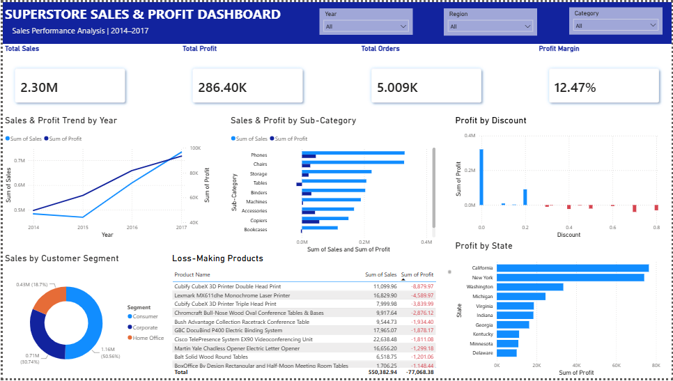

# Superstore Sales & Profit Analysis

## Project Overview
This project analyzes Superstore sales data to evaluate sales performance, profitability, discount impact, customer segments, and loss-making products.

The analysis was performed using **SQL in Google BigQuery**, while **Power BI** was used to build an interactive dashboard for presenting the key findings.

## Business Questions
The analysis focuses on the following questions:

1. How have sales and profit changed over time?
2. Which product sub-categories generate the highest sales and profit?
3. How do discounts affect profitability?
4. Which states contribute the most profit?
5. Which customer segments contribute the most sales?
6. Which products generate losses despite producing sales?

## Tools Used
- **Google BigQuery** — Data exploration and SQL analysis
- **SQL** — Data querying and aggregation
- **Power BI** — Data visualization and interactive dashboard
- **GitHub** — Project documentation and portfolio hosting

## Data Analysis
SQL was used to perform:

- Data quality checks for missing and duplicate values
- Sales and profit analysis by year
- Product sub-category performance analysis
- Discount and profitability analysis
- State-level profit analysis
- Customer segment analysis
- Identification of loss-making products

The complete SQL queries are available in:
`superstore_analysis.sql`

## Dashboard

### Key Metrics
- **Total Sales:** $2.30M
- **Total Profit:** $286.40K
- **Total Orders:** 5,009
- **Profit Margin:** 12.47%

## Key Insights
- Sales and profit show an overall upward trend from 2014 to 2017.
- Phones and Chairs are among the highest-performing sub-categories by sales.
- Higher discount levels are associated with negative profitability, indicating that aggressive discounting can reduce margins.
- California and New York are the strongest profit-contributing states.
- The Consumer segment contributes the largest share of total sales.
- Several products generate substantial sales while still producing losses, highlighting opportunities for pricing and discount optimization.

## Recommendations
- Review high-discount transactions and establish discount limits to protect profitability.
- Investigate loss-making products and evaluate their pricing, discount strategy, and associated costs.
- Prioritize high-performing product categories and markets while maintaining healthy profit margins.
- Continue monitoring sales growth alongside profit margin rather than focusing only on revenue.

## Repository Files
- `superstore_analysis.sql` — SQL queries used for the analysis
- `Superstore_Sales_Analysis.pbix` — Power BI dashboard file
- `superstore_dashboard.png` — Dashboard preview
- `superstore_dataset.csv` — Dataset used in the project

## Author
**Firly Fauzi**  
Aspiring Data Analyst | SQL | Power BI | Python | Excel
